# Fawad Ahmad | Personal Portfolio

<div align="center">

[](https://fawad-ahmad-168-portfolio.vercel.app/)
[](https://nextjs.org/)

[](https://www.typescriptlang.org/)
[](https://tailwindcss.com/)
[](LICENSE)

### A modern, responsive developer portfolio showcasing my projects, technical skills, experience, and passion for building scalable web applications.

**🌐 Live Website:** https://fawad-ahmad-168-portfolio.vercel.app/


</div>

---

# 📖 Overview

This portfolio serves as my personal developer website where I showcase my professional experience, technical skills, featured projects, and development journey.

The project was designed and developed with a strong focus on modern UI/UX, responsiveness, smooth animations, clean architecture, accessibility, and performance.

Rather than being a simple portfolio, it demonstrates my approach to building production-quality web applications using modern technologies and best development practices.

---

# ✨ Features

* 🎨 Modern and responsive user interface
* ⚡ Built with Next.js 16 App Router
* 📱 Mobile-first responsive design
* 🌙 Elegant dark theme
* 🎭 Smooth Framer Motion animations
* ⌨️ Animated typing effect
* 🧩 Reusable component architecture
* 🗂️ Dedicated Project Details pages
* 📄 Resume download functionality
* 📧 Contact form powered by Formspree
* 🔍 SEO optimized pages
* 🚀 Fast page loading
* 📊 Vercel Analytics integration
* 🎯 Clean navigation with smooth scrolling
* 🎨 Beautiful gradients and micro-interactions
* 📂 Project filtering
* 📈 Professional experience timeline
* 🛠️ Technology showcase
* 📱 Fully responsive navigation menu
* ⚠️ Custom 404 page

---

# 🖥️ Website Sections

* 🏠 Hero
* 👨‍💻 About
* 💼 Services
* ⚙️ Skills
* 💼 Experience
* 🚀 Projects
* 📄 Project Details
* 📬 Contact
* 🔗 Footer

---

# 🛠️ Tech Stack

## Frontend

* Next.js
* React 
* TypeScript
* Tailwind CSS
* Framer Motion

## UI Libraries

* shadcn/ui
* Lucide React
* Iconify
* Sonner

## Animation

* Framer Motion
* Lottie React
* React Simple Typewriter

## Forms

* React Hook Form
* Formspree

## Deployment

* Vercel
* Vercel Analytics

---

# 📁 Project Structure

```text
portfolio
├── app/
│   ├── about/
│   ├── contact/
│   ├── experience/
│   ├── projects/
│   ├── skills/
│   ├── layout.tsx
│   └── page.tsx
│
├── components/
│   ├── customUI/
│   ├── lottiefiles/
│   ├── projectDetails/
│   ├── sections/
│   └── ui/
│
├── constants/
├── lib/
├── public/
│   ├── about/
│   ├── documents/
│   ├── experience/
│   ├── home/
│   ├── projects/
│   ├── services/
│   └── skills/
│
├── seo/
├── utils/
│
├── .env.local
├── .gitignore
├── package.json
├── tsconfig.json
└── README.md
```

---

# 🚀 Getting Started

## Clone the repository

```bash
git clone https://github.com/FAWAD-AHMAD-168/Personal-Portfolio.git
```

## Navigate into the project

```bash
cd portfolio
```

## Install dependencies

```bash
npm install
```

## Run the development server

```bash
npm run dev
```

Visit:

```
http://localhost:3000
```

---

# 🔐 Environment Variables

Create a `.env.local` file.

```env
NEXT_PUBLIC_FORMSPREE_URL=YOUR_FORMSPREE_ENDPOINT
```

---

# 📜 Available Scripts

```bash
npm run dev
```

Starts the development server.

```bash
npm run build
```

Creates the production build.

```bash
npm run start
```

Runs the production server.


---

# 📸 Screenshots

>## 📸 Screenshots

<p align="center">
  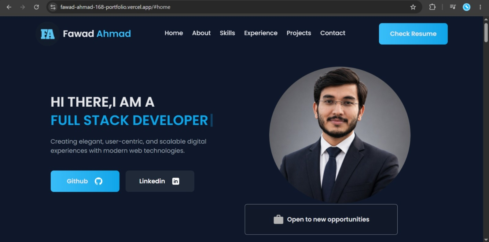
</p>

<p align="center"><strong>Home Page</strong></p>

<br>
<table>
  <tr>
    <td align="center" width="50%">
      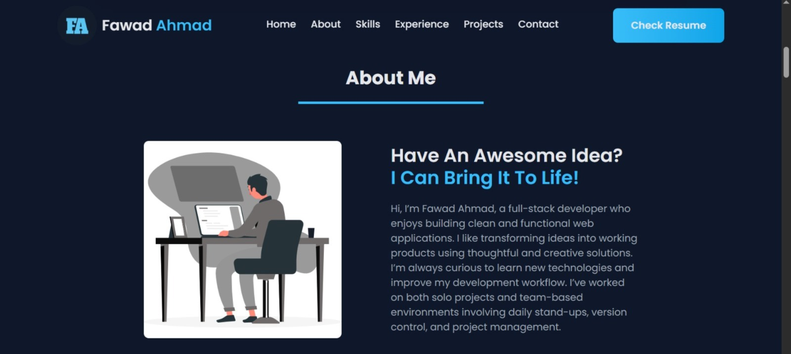<br>
      <strong>👨‍💻 About Me</strong>
    </td>
    <td align="center" width="50%">
      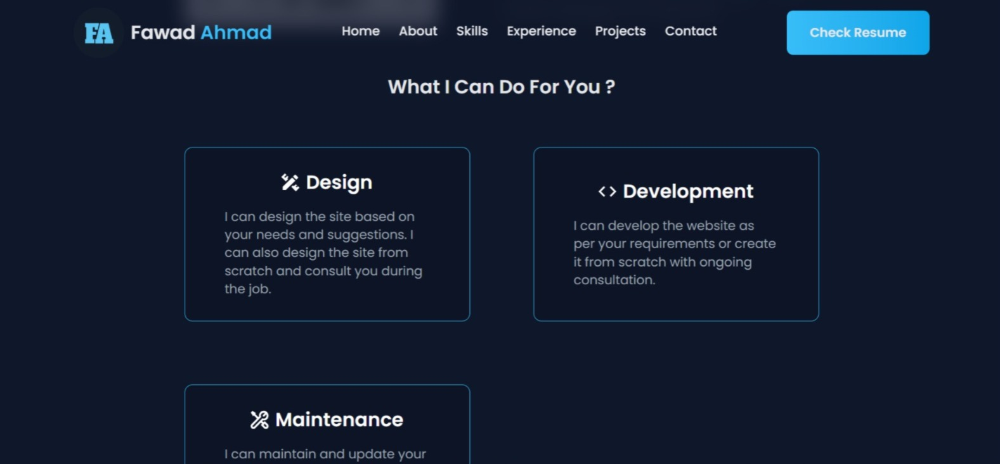<br>
      <strong>🛠️ What I Can Do For You?</strong>
    </td>
  </tr>

  <tr>
    <td align="center">
      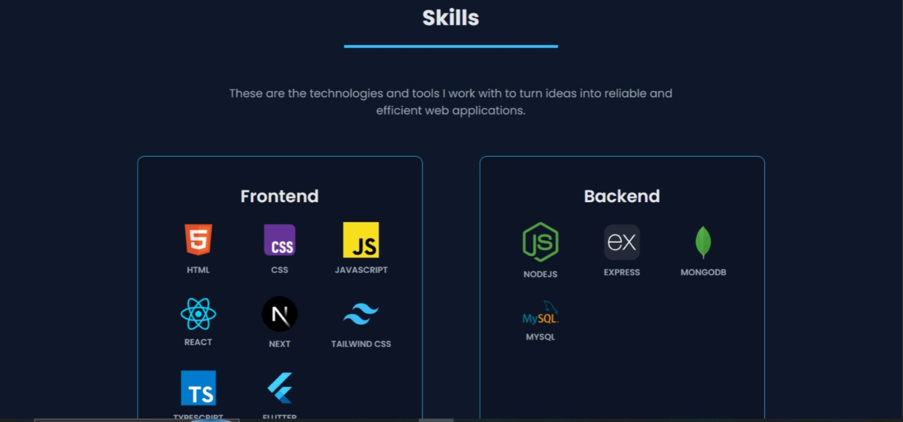<br>
      <strong>⚙️ Frontend Skills</strong>
    </td>
    <td align="center">
      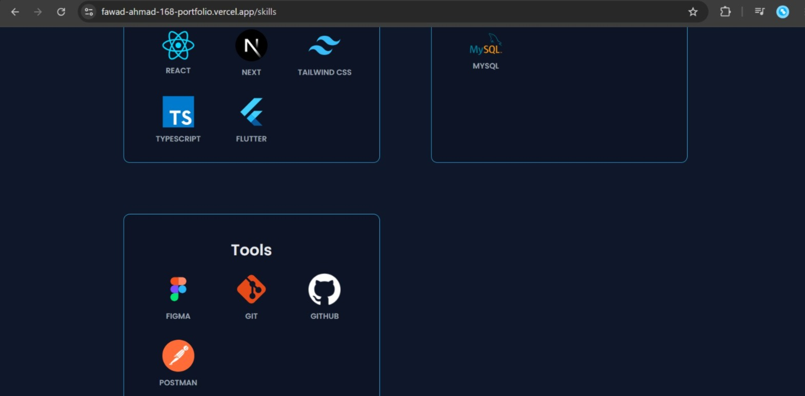<br>
      <strong>🧰 Backend Skills & Tools</strong>
    </td>
  </tr>

  <tr>
    <td align="center">
      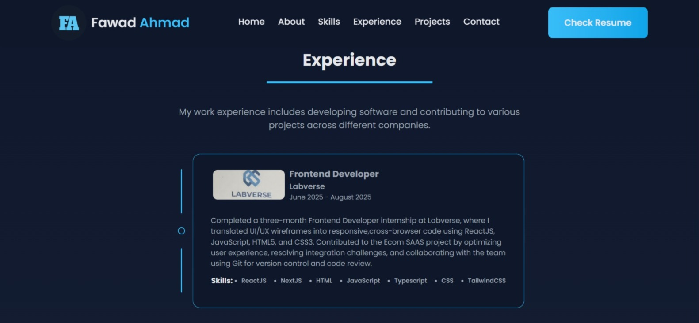<br>
      <strong>💼 Experience</strong>
    </td>
    <td align="center">
      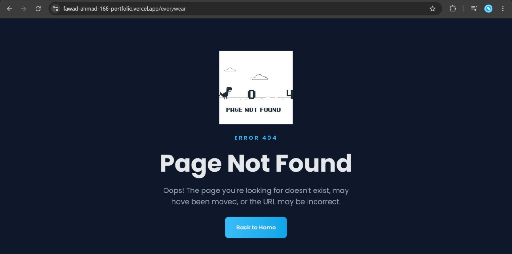<br>
      <strong> 404 - Not Found Page</strong>
    </td>
  </tr>

  <tr>
    <td align="center">
      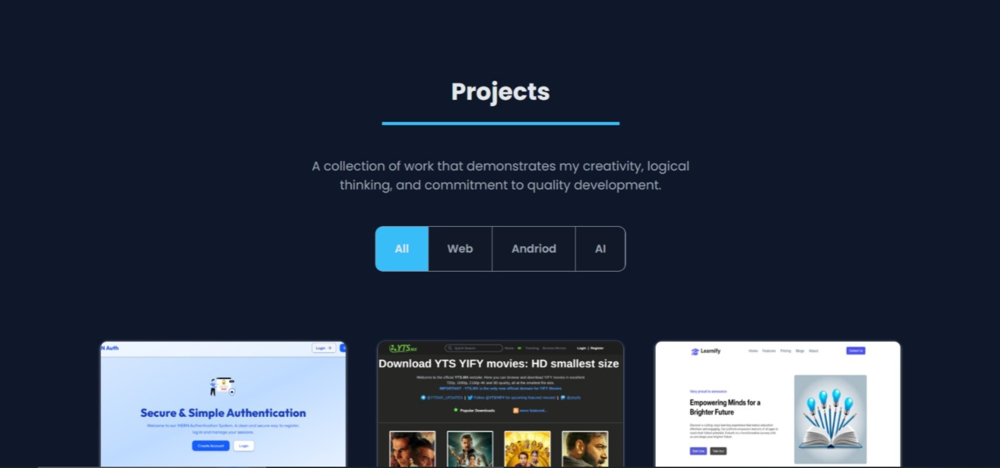<br>
      <strong>🚀 Projects</strong>
    </td>
    <td align="center">
      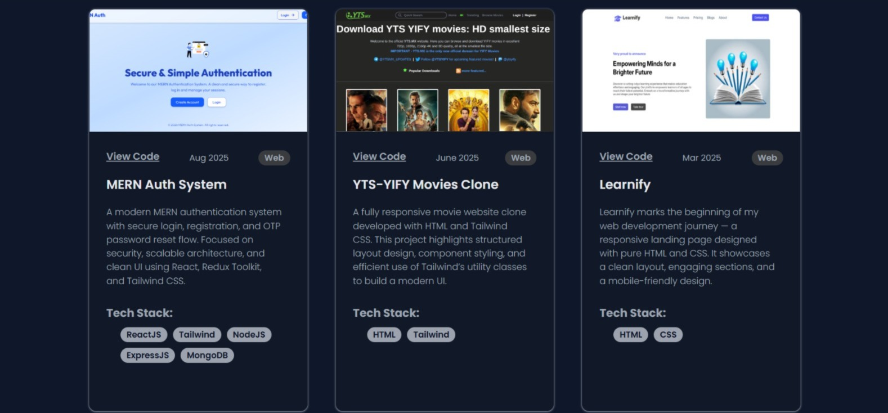<br>
      <strong>📄 Project Details</strong>
    </td>
  </tr>

  <tr>
    <td align="center">
      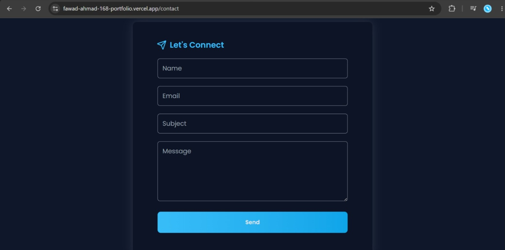<br>
      <strong>📬 Contact</strong>
    </td>
    <td align="center">
      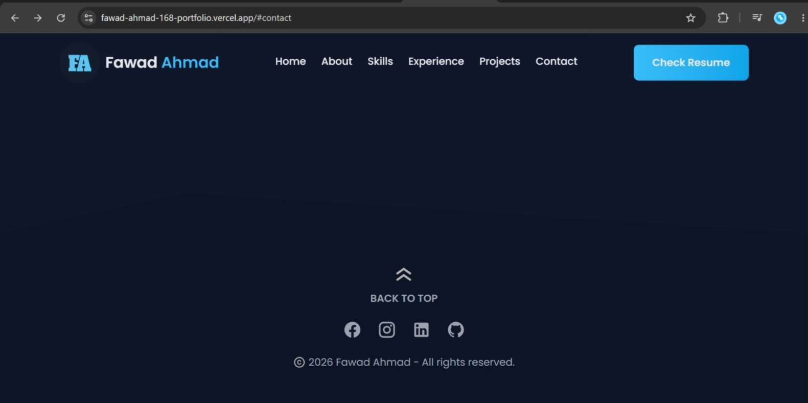<br>
      <strong>🔗 Footer</strong>
    </td>
  </tr>
</table>

---


# 🎯 Performance & Optimization

* App Router architecture
* SEO metadata
* Optimized fonts
* Component-based architecture
* Responsive images
* Clean code organization
* Reusable UI components
* Production build optimization
* Static asset optimization

---

# 🔍 SEO

The portfolio includes:

* Metadata optimization
* Page-specific SEO configuration
* Semantic HTML
* Clean URLs
* Search engine friendly structure

---

# ♿ Accessibility

This project follows accessibility best practices including:

* Semantic HTML
* Responsive layouts
* Keyboard-friendly navigation
* Readable typography
* High color contrast
* Accessible interactive elements

---

# 💡 Challenges Faced

During development, I solved several real-world challenges including:

* Creating a fully responsive layout across all devices.
* Designing reusable and scalable UI components.
* Implementing smooth and synchronized animations.
* Structuring project detail pages using the App Router.
* Optimizing performance while maintaining rich animations.
* Managing SEO across multiple pages.
* Resolving Windows vs. Linux filename casing issues during Vercel deployment.
* Organizing a clean and maintainable project architecture.

---

# 📈 Future Improvements

Planned improvements include:

* 🌙 Theme switcher
* 📊 Advanced analytics dashboard
* 🤖 AI-powered chatbot
* 🎖️ Certifications section

---

# 👨‍💻 Author

## Fawad Ahmad

Full-Stack Developer

* 🌐 Portfolio: https://fawad-ahmad-168-portfolio.vercel.app/
* 💼 GitHub: https://github.com/FAWAD-AHMAD-168

> *Feel free to connect with me for collaboration, freelance opportunities, or full-time roles.*

---

# 🤝 Contributing

Contributions, suggestions, and feedback are always welcome.

If you'd like to improve this project:

1. Fork the repository.
2. Create a new branch.
3. Make your changes.
4. Submit a Pull Request.

---

# ⭐ Support

If you found this project helpful or inspiring, consider giving it a ⭐ on GitHub.

It helps support my work and motivates me to build more open-source projects.

---

# 📄 License

This project is licensed under the MIT License.

---

<div align="center">

### Thank you for visiting my portfolio! 🚀

**Built with ❤️ using Next.js, TypeScript & Tailwind CSS**

</div>
